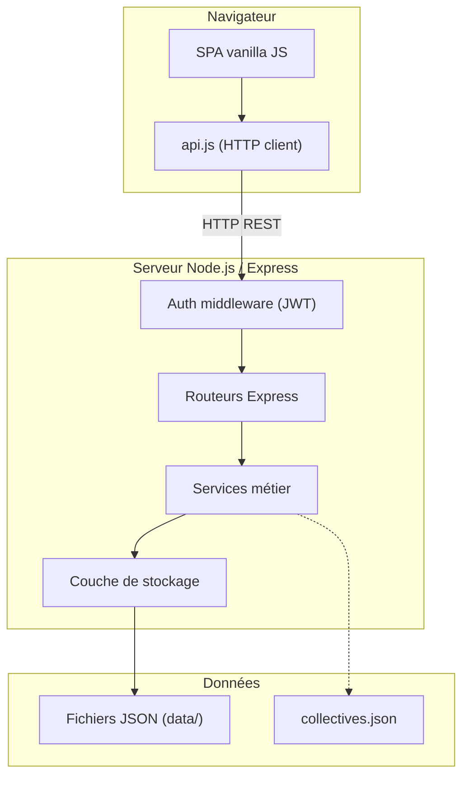
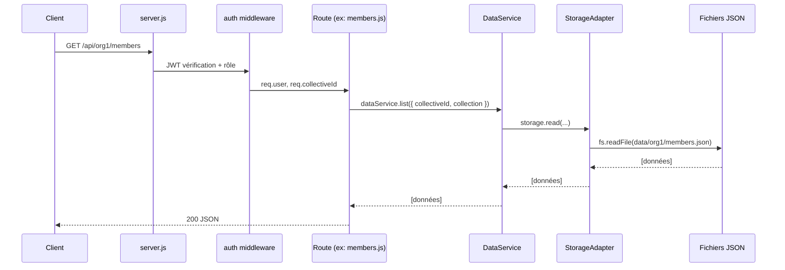
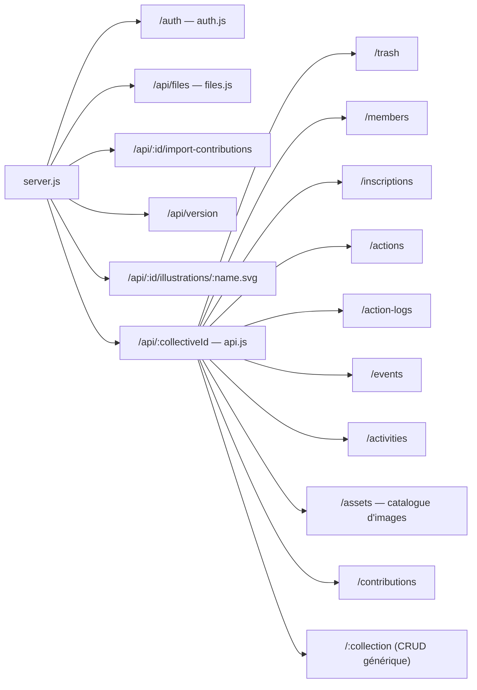
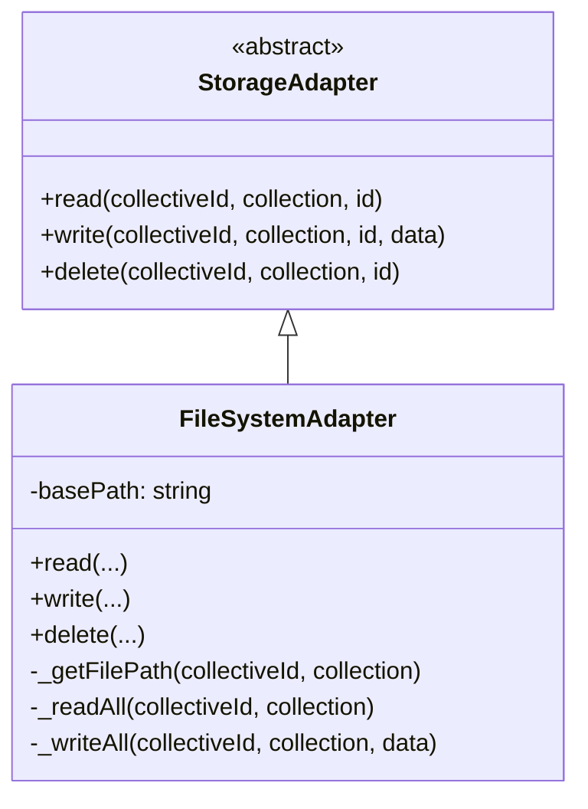
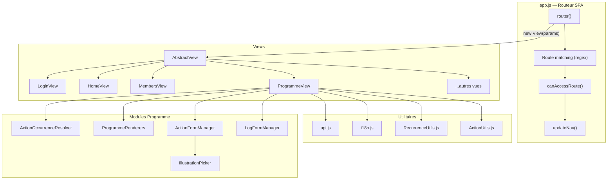
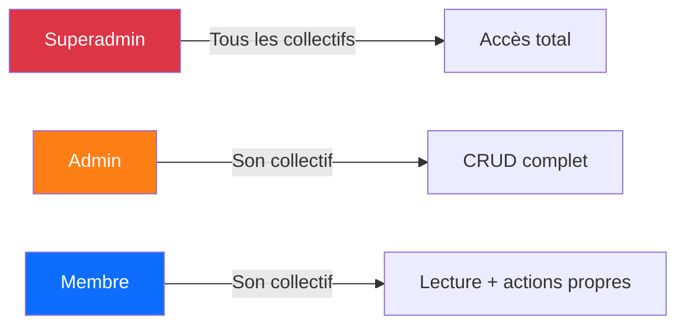

# Architecture du projet Feddeeji

Application web de gestion de collectifs — backend Node.js / Express, frontend vanilla JS (SPA).

---

## Alarmes Home Assistant

Guide de configuration et YAML : [docs/home-assistant.md](docs/home-assistant.md).

- `NotificationConfig` valide `action.alert` et les paramètres communs (fuseau IANA,
  silence nocturne, origines HA autorisées et exceptions TLS explicites).
- `ActionNotificationScheduler` contrôle toutes les 30 s, puis rappelle toutes les
  10 min par destinataire, hors silence. Les transitions suivantes sont relatives
  à l’horodatage serveur de validation de l’étape précédente.
- `NotificationStateService` utilise directement le stockage pour `notification-state` :
  paramètres, tentatives par destinataire, tokens aléatoires hashés/expirables/révocables.
  Collection interdite au CRUD générique, à `DataService` et à la restauration corbeille.
- `ActionProgressService` centralise les réalisations interface/mobile, sérialise par
  action et compare occurrence/étape/révision avant toute validation. Le backend importe
  le même `RecurrenceUtils` que le frontend. Les anciens logs sans état restent terminés.
- `POST /notification-callbacks/ack` est monté avant le routeur JWT, mais authentifie
  chaque requête avec une capacité aléatoire limitée à un destinataire/occurrence/étape.
  POST-only, limitation globale 120 requêtes/minute, aucune URL fournie par le client.
- `/api/:collectiveId/notifications/settings` (GET/PUT), `/diagnostics` (GET) et
  `/trigger` (POST) sont admin et limités au collectif ; `/test-ha` permet aussi au membre
  de tester son propre webhook. Le test ne valide aucune étape.
- HA relaie `reminder`/`clear`/`test` vers Companion puis le bouton Fait vers Feddeeji.
  L’effacement visuel est best effort ; le serveur reste la référence de progression.
- Le stockage fichier sérialise les mutations par fichier dans un seul processus Node
  et remplace les JSON par renommage atomique. Pas de transactions inter-fichiers ni
  de garantie multi-worker ; un crash entre acceptation HA et persistance peut doubler
  un envoi, mais un ancien bouton ne doit jamais valider l’étape suivante.

**Migration :** les anciennes actions restent sans rappels insistants tant qu’un admin
ne les active pas. L’ancien rappel quotidien implicite est remplacé ; configurer les
origines HA et installer les automatisations v1 avant activation.

## Vue d'ensemble



---

## Backend

### Arborescence

```
src/backend/
├── server.js                  # Point d'entrée Express
├── middleware/
│   ├── auth.js                # JWT : createAuthMiddleware, requireRole
│   ├── asyncHandler.js        # Wrapper try/catch pour les handlers async
│   └── memberOwnership.js     # Filtrage/restriction d'accès membre
├── routes/
│   ├── api.js                 # Routeur API principal (compose les sous-routeurs)
│   ├── auth.js                # /auth — login, register, token
│   ├── files.js               # /api/files — upload/download (superadmin)
│   ├── members.js             # /api/:collectiveId/members
│   ├── events.js              # /api/:collectiveId/events
│   ├── inscriptions.js        # /api/:collectiveId/inscriptions
│   ├── actions.js             # /api/:collectiveId/actions
│   ├── activities.js          # /api/:collectiveId/activities
│   ├── assets.js              # /api/:collectiveId/assets (photos + illustrations locales)
│   ├── activityHistory.js     # /api/:collectiveId/activity-history
│   ├── actionLogs.js          # /api/:collectiveId/action-logs
│   └── trash.js               # /api/:collectiveId/trash
├── services/
│   ├── AuthService.js         # Authentification JWT, hash bcrypt
│   ├── CollectiveService.js   # CRUD collectifs (collectives.json)
│   ├── DataService.js         # CRUD générique via StorageAdapter
│   ├── ImportService.js       # Import XLSX (contributions)
│   ├── AssetService.js        # Catalogue Wikimedia + copie locale des images
│   ├── IllustrationService.js # Catalogue Tabler + rendu SVG dessiné
│   ├── LogService.js          # Journal des opérations utilisateur
│   └── TrashService.js        # Corbeille (soft delete / restore)
└── storage/
    ├── StorageAdapter.js       # Interface abstraite (read, write, delete)
    └── FileSystemAdapter.js    # Implémentation fichiers JSON locaux
```

### Chaîne de traitement d'une requête API



### Montage des routes (server.js)



### Services

| Service              | Responsabilité                                                    |
|----------------------|-------------------------------------------------------------------|
| `AuthService`        | Login (superadmin, admin, member), hash mot de passe, vérif JWT   |
| `CollectiveService`  | CRUD collectifs, type concret, logo local et palette dérivée de `primaryColor` |
| `DataService`        | CRUD générique par collection via `StorageAdapter`, journalisation |
| `TrashService`       | Soft delete → corbeille, restauration, suppression définitive      |
| `LogService`         | Journal horodaté des opérations (ajout, modif, suppression)       |
| `ImportService`      | Import de fichiers XLSX vers la collection contributions          |
| `AssetService`       | Recherche Wikimedia Commons, validation et copie locale des images choisies |
| `IllustrationService` | Recherche Tabler FR/EN, validation des recettes et rendu SVG `doodle-v1` |

### Stockage



Les données sont stockées dans `data/<collectiveId>/<collection>.json`.
La couche d'abstraction permet d'ajouter un adaptateur MongoDB ou S3 sans modifier les services.

### Middleware

| Middleware            | Rôle                                                                                  |
|-----------------------|---------------------------------------------------------------------------------------|
| `auth.js`             | Vérifie le JWT, injecte `req.user`. `requireRole(...)` restreint par rôle.            |
| `asyncHandler.js`     | Enveloppe un handler async et renvoie une erreur HTTP en cas d'exception.             |
| `memberOwnership.js`  | Force `memberId` pour les membres, vérifie la propriété des ressources, gère les cas spéciaux (événements passés, accès aux notes). |

---

## Frontend

### Arborescence

```
src/frontend/
├── index.html             # Page unique (shell SPA, navbar Bootstrap 5)
├── favicon.svg
├── css/
│   └── style.css          # Styles personnalisés
└── js/
    ├── app.js             # Routeur SPA (history API), navigation, permissions
    ├── api.js             # Client HTTP REST (fetch), gestion du token JWT
    ├── i18n.js            # Internationalisation fr/en
    ├── RecurrenceUtils.js          # Calcul des occurrences récurrentes
    ├── ActionUtils.js              # Normalisation des actions, nom de membre
    ├── ActionOccurrenceResolver.js # Résolution occurrences (statut, état, fenêtre)
    ├── IllustrationPicker.js       # Catalogue local et choix d'un dessin par action
    ├── ProgrammeRenderers.js       # Rendu HTML liste/calendrier/historique
    ├── ActionFormManager.js        # Modal CRUD actions
    ├── LogFormManager.js           # Modal logs (done/note/consultation)
    └── views/
        ├── AbstractView.js           # Classe de base (setTitle, getHtml, init)
        ├── LoginView.js              # Connexion
        ├── RegisterView.js           # Inscription membre
        ├── CollectiveListView.js     # Liste des collectifs (superadmin)
        ├── HomeView.js               # Accueil du collectif
        ├── MembersView.js            # Gestion des membres (admin)
        ├── ContributionsView.js      # Contributions / cotisations
        ├── EventsView.js             # Gestion des événements
        ├── ActivitiesView.js         # Modèles d'activités (liste + édition admin)
        ├── ActivityRunView.js        # Exécution d'une activité (étapes, timer)
        ├── InscriptionsView.js       # Inscriptions aux événements
        ├── InscriptionScheduleView.js # Planning d'inscriptions récurrentes
        ├── ProgrammeView.js          # Programme (actions + événements)
        ├── ActionHistoryView.js      # Historique des actions
        ├── ProfileView.js            # Profil membre
        └── TrashView.js              # Corbeille (admin)
```

### Architecture SPA



### Cycle de vie d'une vue

1. Le routeur (`app.js`) écoute `popstate` et les clics `[data-link]`
2. Il fait correspondre l'URL à une route et instancie la vue associée
3. `view.getHtml()` retourne le HTML du composant
4. Le HTML est injecté dans `#app`, les traductions sont appliquées
5. `view.init()` attache les écouteurs d'événements et charge les données

### Routes frontend

| Route                                                     | Vue                      | Rôles          |
|-----------------------------------------------------------|--------------------------|----------------|
| `/login`                                                  | LoginView                | public         |
| `/:collectiveId/login`                                    | LoginView                | public         |
| `/:collectiveId/register`                                 | RegisterView             | public         |
| `/`                                                       | CollectiveListView       | superadmin     |
| `/:collectiveId`                                          | HomeView                 | tous           |
| `/:collectiveId/members`                                  | MembersView              | admin          |
| `/:collectiveId/contributions`                            | ContributionsView        | admin, member  |
| `/:collectiveId/events`                                   | EventsView               | tous           |
| `/:collectiveId/inscriptions`                             | InscriptionsView         | tous           |
| `/:collectiveId/events/:eventId/inscription-schedule`     | InscriptionScheduleView  | tous           |
| `/:collectiveId/activities`                               | ActivitiesView           | tous           |
| `/:collectiveId/activities/:activityId`                   | ActivityRunView          | tous           |
| `/:collectiveId/programme`                                | ProgrammeView            | tous           |
| `/:collectiveId/action-history`                           | ActionHistoryView        | tous           |
| `/:collectiveId/profile`                                  | ProfileView              | member         |
| `/:collectiveId/trash`                                    | TrashView                | admin          |

### Utilitaires JS

| Module               | Responsabilité                                                          |
|----------------------|-------------------------------------------------------------------------|
| `api.js`             | Client HTTP, gestion du token JWT, CRUD et catalogue d'assets (`searchAssets`, `importAsset`) |
| `i18n.js`            | Dictionnaires fr/en, fonction `t(key)`, événement `langChanged`         |
| `RecurrenceUtils.js` | Génération d'occurrences (daily, weekly, monthly) avec intervalles et exceptions |
| `ActionUtils.js`     | `normalize(action)` : conversion des anciens formats de récurrence ; `getMemberName(id, members)` |
| `ActionOccurrenceResolver.js` | Résolution des prochaines occurrences, calcul statut (overdue/due/ok) et état courant |
| `IllustrationPicker.js` | Suggestions et recherche locale d'illustrations pour une action |
| `ProgrammeRenderers.js` | Rendu HTML statique : items liste, grille calendrier, historique, notes existantes |
| `ActionFormManager.js` | Gestion du modal CRUD actions (ouverture, sauvegarde, template, récurrence) |
| `LogFormManager.js`  | Gestion du modal logs : modes done, note, consultation hors-fenêtre     |

---

## Modèle de données

Les données sont organisées par collectif dans des fichiers JSON :

```
data/
├── logos/                     # Logos des collectifs
├── uploads/                   # Fichiers uploadés (superadmin)
├── <collectiveId>/
│   ├── members.json           # Membres du collectif
│   ├── contributions.json     # Cotisations / contributions
│   ├── events.json            # Événements (récurrents ou non)
│   ├── inscriptions.json      # Inscriptions aux événements
│   ├── actions.json           # Actions programmées + recette d'illustration
│   ├── activities.json        # Modèles d'activités (titre, étapes, images, membres, trackHistory)
│   ├── activity-history.json  # Journal des réalisations d'activités (si trackHistory)
│   ├── action-logs.json       # Historique d'exécution des actions
│   ├── uploads/               # Images uploadées ou importées depuis la médiathèque
│   ├── admins.json            # Comptes admin du collectif
│   ├── trash.json             # Corbeille
│   └── logs.json              # Journal des opérations
└── ...
```

Le fichier `collectives.json` à la racine du projet contient la liste des collectifs
(id, nom, label, `typeLabel`, email admin, langue par défaut, options, palette
dérivée de `primaryColor` et éventuelle recette `logoIllustration`). Le terme
« collectif » reste réservé à l’administration globale ; l’interface interne
emploie `typeLabel` (association, club, groupe…). Une action peut contenir une
recette stable :

```json
{
  "illustration": {
    "collection": "tabler",
    "name": "wash",
    "style": "doodle-v1",
    "seed": 18427
  }
}
```

Le SVG n'est stocké ni dans l'action ni dans le logo : il est rendu localement
avec les couleurs courantes du collectif, puis validé par `ETag`. Changer la
couleur recolore donc toutes les illustrations sans migration des données. Le
superadmin recherche les logos dans le même catalogue Tabler local que les
actions ; un aperçu générique permet aussi le choix avant la création.

---

## Rôles et permissions



| Rôle         | Périmètre                 | Droits                                                                |
|--------------|---------------------------|-----------------------------------------------------------------------|
| `superadmin` | Tous les collectifs        | Tout : CRUD collectifs, upload de fichiers, accès admin sur chaque org |
| `admin`      | Un collectif               | CRUD membres, événements, actions, contributions, corbeille, import    |
| `member`     | Un collectif (ses données) | Consultation événements/programme, inscriptions propres, actions propres, profil |

---

## Stack technique

| Couche     | Technologie                                    |
|------------|------------------------------------------------|
| Backend    | Node.js, Express, JWT (jsonwebtoken), bcryptjs  |
| Frontend   | Vanilla JS (ES6 classes), HTML5 History API     |
| UI         | Bootstrap 5, Bootstrap Icons                    |
| Assets     | Photos Wikimedia + 6 232 icônes Tabler locales rendues en SVG `doodle-v1` |
| Stockage   | Fichiers JSON (extensible via StorageAdapter)   |
| i18n       | Dictionnaire JS côté client (fr / en)           |
| Import     | xlsx (lecture de fichiers Excel)                 |
